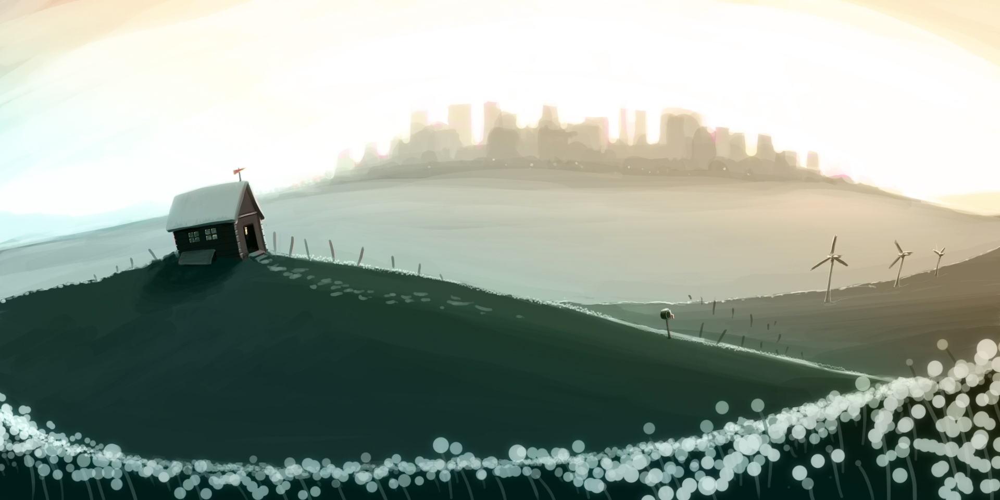
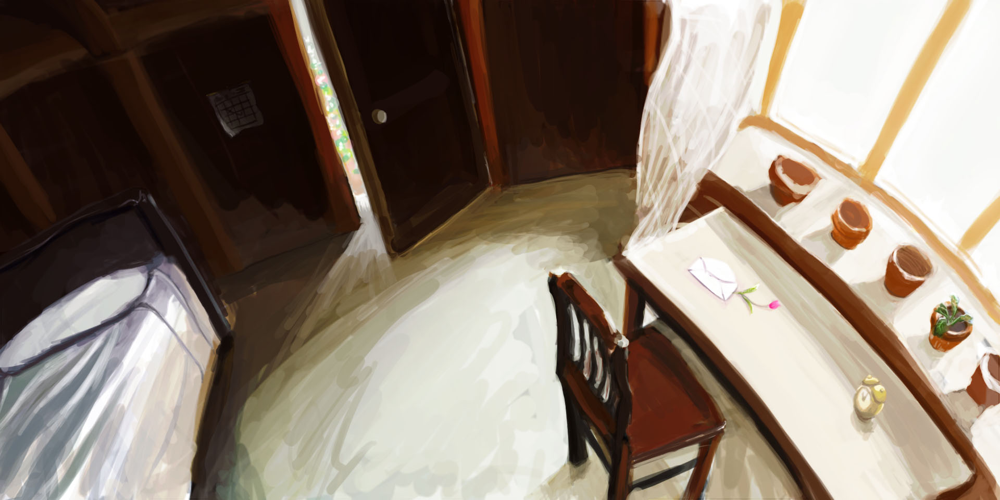
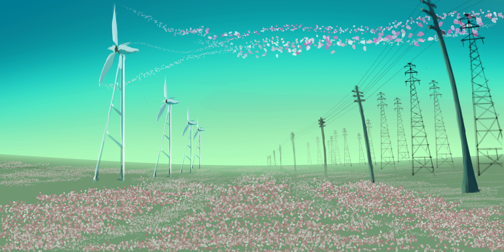

Project-Tiles
=============

jQuery plugin that produces a grid, click active state, and CSS driven functions.

=============

What is Project Tiles?
Project Tiles is a jquery plugin that was originally meant to be used as a way to present a portfolio (a la project tiles) but during the development began to take shape as an idea in which could be used for more than just that one application. Along came the idea that it could be used to replace the traditional slideshow or be used for callouts: there were more possibilities.
As a plugin: a majority of Project Tile’s magic is done through CSS, namely CSS3. Modernizr is included as well for backward compatibility so the script can pick and choose when to use CSS3 for animation and when to use jQuery’s animation function instead (there are two packages: one with modernizr, and one without modernizr).
ProjectTiles works as so:
The developer/designer sets how many tiles they want in a grid, defined in the initialization (rows & columns). The developer/designer then creates a table with TR elements that will correspond to the number of grid tiles they defined in the initialization which will be represented on the front-end. ProjectTiles then takes the number of rows and columns, does some math to determine how tall and wide each one should be in proportion to it’s container, the creates those tiles along with the the content from the table created earlier.
When a user hovers over a tile, the tile adds a hover class and will animate the caption accordingly (defined by the designer/developer). When the tile is clicked, the tile will expand to the full height and width of the container to reveal it’s content.
Demo
It’s a simple idea, but one that has potential. If you’re interested in using this then get to it skippy!
Implementation
Project Tiles implementation is simple:
1.) Include jQuery, modernizr, and ProjectTiles in your header:
! 
 
2.) Add ProjectTiles CSS to your project. either add it to your existing CSS file or create a new one:
/* Tile container - This can be whatever you want*/ #wrapMedia{width:800px;height:400px;margin:0 auto;position:relative;}
/* Tile styles */

.projectTile{border:#666;float:left;transition:all 0.3s;z-index: 5;overflow:hidden;
background-position:center center} .projectTile.active{z-index:10;position:absolute;}
/* Caption styles */ .tileCaption{position:absolute;height:50%;width: 100%;background:rgba(41,101,160,0.75);display:block;color:#fff;}
.active .tileCaption{display:none;}
.tileCaption .gutter{padding:20px;}
.tileCaption h3{font-family:Helvetica,Arial,sans-serif;font-size:
24px;font-weight:700;text-transform: uppercase;}
/* Content styles -- Each tile is given it's own ID can can be styled individucally based on that ID */
.tileContent{display:none;}
.active .tileContent{background: none repeat scroll 0 0 rgba(255, 255, 255, 0.75);border: 3px solid #AAAAAA;border-radius: 30px 30px 30px 30px;bottom: 5%;display: block;left: 3%;position: absolute;width: 75%;}
.tileContent .gutter{padding:20px;}
#tile_1 .tileContent{background:rgba(191,21,21,0.75);color:#fff;width: 50%;height:90%;}
#tile_5 .tileContent{background:rgba(21,191,32,0.75);color:#fff;width: 75%;height:75%;top:10%;left:10%;border-radius: 0;}
#tile_5 .tileContent .gutter{padding:0;}
/* Close button styling */ .closeButton{display:none;}
.active .closeButton{background:#ccc;position:absolute;right: 10px;top:10px;display:block;text-indent:-9999px;height:20px;width: 20px;z-index:20;}
.active .closeButton:hover{cursor:pointer;}
/* Hide the management table */ #tileTable{display:none;}
3.) Add the ProjectTiles markup to your project:
<table id="tileTable">
<tr>
height="960"></td>
<td><h3>This is slide 1</h3></td>
<td><h3>Tile title 1</h3>
This is some content for the first tile. It is styled based on the default classes attached to each
tile and is not using the unique ID for individual styling.
</td> </tr>
<tr>
height="960"></td>
<td><h3>This is slide 2</h3></td>
<td><h3>Tile title 2</h3>
This is some content for the second tile. This tile is using the unique ID attached to it to create a
unique style experience.
</td> </tr>
<tr>
height="960"></td>
<td><h3>This is slide 3</h3></td>
<td><h3>Tile title 3</h3>
This is some content for the third tile. It is styled based on the default classes attached to each
tile and is not using the unique ID for individual styling.
</td> </tr>
<tr>
height="960"></td>
<td><h3>This is slide 4</h3></td>
<td><h3>Tile title 4</h3>
This is some content for the fourth tile. It is styled based on the default classes attached to each
tile and is not using the unique ID for individual styling.
</td> </tr>
<tr>
height="960"></td>
<td><h3>This is slide 5</h3></td>
<td><h3>Tile title 5</h3>
This is some content for the fifth tile. It is styled based on the default classes attached to each
tile and is not using the unique ID for individual styling.
</td> </tr>
<tr>
height="960"></td>
<td><h3>This is slide 6</h3></td>
<td><iframe class="resize" width="560" height="315" src="https://www.youtube.com/embed/EwOUi4JDC4o?rel=0" frameborder="0"
allowfullscreen></iframe></td> </tr>
</table>
A table named with the ID tileTable is required for ProjectTiles to work. The table’s TR elements should each have 3 TD’s:
1. BackgroundImage(ifyouwantindividualizedBGs) 2. Captioncontent(forhovereffect)
3. Activecontent
All the content above is for a bare-bones variant of ProjectTiles that’ll show the functionality of the plugin as a starting place.
4.) Initialize ProjectTiles:

In the above initialization, replace #wrapMedia with the element you want to act as the container for ProjectTiles. Like any good plugin, there are plenty of variables you can change to better tool ProjectTiles to work for you:
Variable
Expected Variables
Effect
rows
Integer (eg 2)
Number of rows
columns
Integer (eg 3)
Number of columns
margin
integer (eg 10)
amount of space between tiles. Calculated in px
capAnimation
true or false
Determine whether you want to use the default caption animations. If false, you will be on your own to command the default .hover class using jQuery or CSS3
capDirect
top,bottom,left,right
Direction you want the caption to fly in from
capSpeed
integer (eg 200)
Speed you want the caption to fly. Calculated in ms
capPosition
top,bottom
Position of caption in the tile. Not functional if you choose capDirect top or bottom
activeSpeed
integer (eg 200)
Speed you want the click function to perform. Calculated in ms
activeClass
string (eg active)
Class you want to add for when a tile is clicked
iFrame resizing
If you want iFrames to resize inside the tiles then add resize as a class to the iframe you want to resize. Any iFrames with the resize class will automatically resize itself to the
height and width of it’s container; so you can add a youtube video to your tile while maintaining the enlarge/shrink effect.
Download
